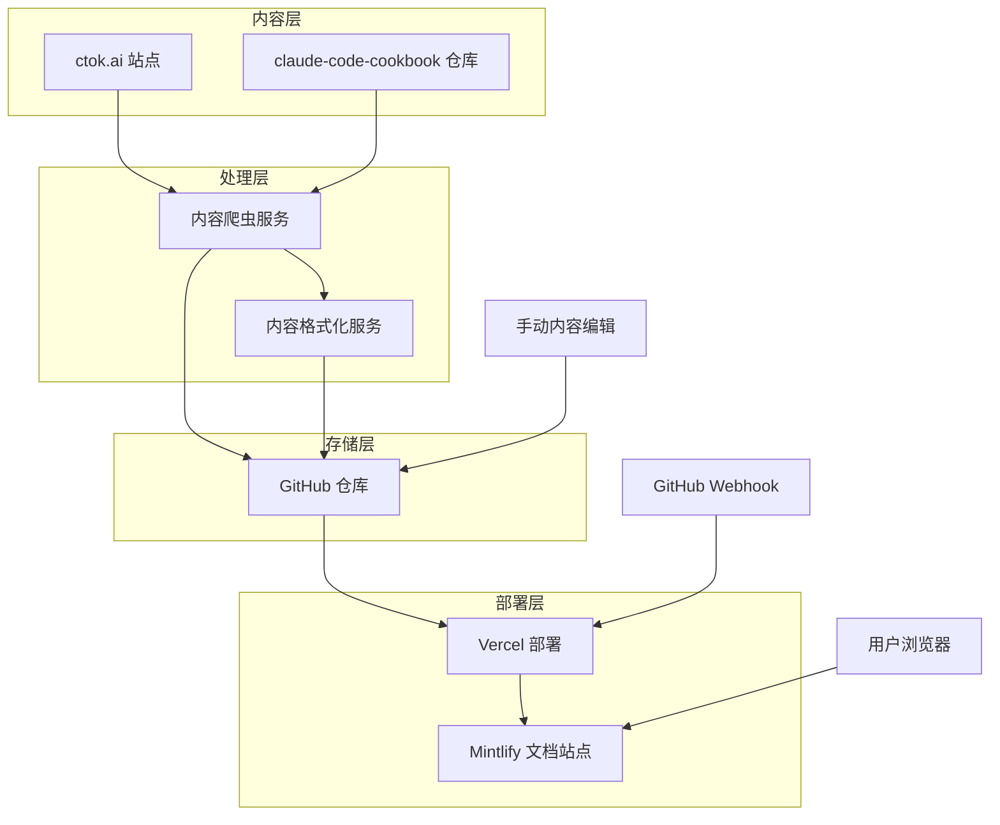
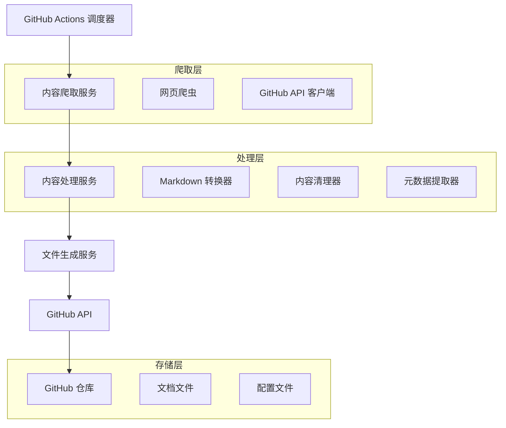
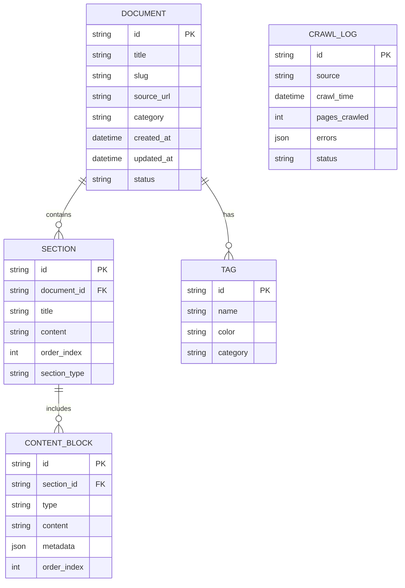

# Claude Code 最佳实践文档中心 - 技术架构文档

## 1. 架构设计



## 2. 技术描述

* **前端**: Mintlify 文档平台 + 自定义配置

* **内容管理**: GitHub 仓库 + Markdown 文件

* **内容获取**: Node.js 爬虫服务 + GitHub Actions

* **部署**: Vercel + GitHub Webhook 自动部署

* **监控**: Vercel Analytics + GitHub Actions 状态监控

## 3. 路由定义

| 路由                                | 用途                  |
| --------------------------------- | ------------------- |
| /                                 | 首页，展示项目介绍和快速导航      |
| /workflows                        | 工作流程指南主页，展示所有工作流程分类 |
| /workflows/understanding-codebase | 理解新代码库的详细指南         |
| /workflows/fixing-bugs            | 高效修复错误的工作流程         |
| /workflows/refactoring            | 代码重构最佳实践            |
| /workflows/testing                | 测试处理指南              |
| /workflows/pull-requests          | PR 创建和管理流程          |
| /workflows/documentation          | 文档处理最佳实践            |
| /workflows/image-handling         | 图像处理工作流程            |
| /workflows/extended-thinking      | 扩展思考使用指南            |
| /commands                         | 命令参考主页              |
| /commands/\[command-name]         | 具体命令的详细说明页面         |
| /roles                            | 角色设置指南              |
| /roles/\[role-name]               | 具体角色的使用说明           |
| /search                           | 全站搜索页面              |
| /about                            | 关于页面，项目介绍和贡献指南      |

## 4. API 定义

### 4.1 内容爬取 API

**爬取 ctok.ai 内容**

```
GET /api/crawl/ctok
```

请求参数:

| 参数名      | 参数类型      | 是否必需  | 描述           |
| -------- | --------- | ----- | ------------ |
| force    | boolean   | false | 是否强制重新爬取所有内容 |
| sections | string\[] | false | 指定要爬取的章节     |

响应:

| 参数名     | 参数类型      | 描述      |
| ------- | --------- | ------- |
| success | boolean   | 爬取是否成功  |
| pages   | number    | 爬取的页面数量 |
| errors  | string\[] | 错误信息列表  |

示例:

```json
{
  "force": false,
  "sections": ["workflows", "best-practices"]
}
```

**爬取 claude-code-cookbook 内容**

```
GET /api/crawl/cookbook
```

请求参数:

| 参数名    | 参数类型   | 是否必需  | 描述            |
| ------ | ------ | ----- | ------------- |
| repo   | string | true  | GitHub 仓库路径   |
| branch | string | false | 分支名称，默认为 main |

响应:

| 参数名      | 参数类型    | 描述      |
| -------- | ------- | ------- |
| success  | boolean | 爬取是否成功  |
| commands | number  | 爬取的命令数量 |
| roles    | number  | 爬取的角色数量 |

**内容同步状态**

```
GET /api/sync/status
```

响应:

| 参数名      | 参数类型   | 描述                        |
| -------- | ------ | ------------------------- |
| lastSync | string | 最后同步时间                    |
| status   | string | 同步状态 (idle/running/error) |
| nextSync | string | 下次计划同步时间                  |

## 5. 服务架构图



## 6. 数据模型

### 6.1 数据模型定义



### 6.2 文件结构定义

**文档仓库结构**

```
docs/
├── mint.json                 # Mintlify 配置文件
├── introduction.mdx          # 首页内容
├── workflows/
│   ├── understanding-codebase.mdx
│   ├── fixing-bugs.mdx
│   ├── refactoring.mdx
│   ├── testing.mdx
│   ├── pull-requests.mdx
│   ├── documentation.mdx
│   ├── image-handling.mdx
│   └── extended-thinking.mdx
├── commands/
│   ├── overview.mdx
│   ├── analyze-dependencies.mdx
│   ├── analyze-performance.mdx
│   ├── check-fact.mdx
│   └── [其他命令文档]
├── roles/
│   ├── overview.mdx
│   ├── analyzer.mdx
│   ├── architect.mdx
│   ├── frontend.mdx
│   └── [其他角色文档]
├── about.mdx
└── search.mdx

scripts/
├── crawlers/
│   ├── ctok-crawler.js       # ctok.ai 内容爬虫
│   ├── cookbook-crawler.js   # cookbook 内容爬虫
│   └── content-processor.js  # 内容处理器
├── deploy/
│   └── sync-content.js       # 内容同步脚本
└── utils/
    ├── markdown-utils.js     # Markdown 工具函数
    └── github-utils.js       # GitHub API 工具函数

.github/
└── workflows/
    ├── crawl-content.yml     # 定时爬取内容
    ├── deploy.yml            # 部署工作流
    └── content-validation.yml # 内容验证
```

**Mintlify 配置示例**

```json
{
  "name": "Claude Code 最佳实践中心",
  "logo": {
    "dark": "/logo/dark.svg",
    "light": "/logo/light.svg"
  },
  "favicon": "/favicon.svg",
  "colors": {
    "primary": "#1e40af",
    "light": "#3b82f6",
    "dark": "#1e3a8a"
  },
  "navigation": [
    {
      "group": "开始使用",
      "pages": ["introduction"]
    },
    {
      "group": "工作流程指南",
      "pages": [
        "workflows/understanding-codebase",
        "workflows/fixing-bugs",
        "workflows/refactoring",
        "workflows/testing",
        "workflows/pull-requests",
        "workflows/documentation",
        "workflows/image-handling",
        "workflows/extended-thinking"
      ]
    },
    {
      "group": "命令参考",
      "pages": ["commands/overview"]
    },
    {
      "group": "角色设置",
      "pages": ["roles/overview"]
    },
    {
      "group": "其他",
      "pages": ["about"]
    }
  ],
  "footerSocials": {
    "github": "https://github.com/your-username/claude-code-best-practices"
  },
  "analytics": {
    "gtag": {
      "measurementId": "G-XXXXXXXXXX"
    }
  }
}
```

**GitHub Actions 工作流示例**

```yaml
# .github/workflows/crawl-content.yml
name: 爬取内容更新

on:
  schedule:
    - cron: '0 2 * * *'  # 每天凌晨2点执行
  workflow_dispatch:     # 支持手动触发

jobs:
  crawl-and-update:
    runs-on: ubuntu-latest
    steps:
      - uses: actions/checkout@v3
      - uses: actions/setup-node@v3
        with:
          node-version: '18'
      
      - name: 安装依赖
        run: npm install
      
      - name: 爬取 ctok.ai 内容
        run: node scripts/crawlers/ctok-crawler.js
        env:
          GITHUB_TOKEN: ${{ secrets.GITHUB_TOKEN }}
      
      - name: 爬取 cookbook 内容
        run: node scripts/crawlers/cookbook-crawler.js
        env:
          GITHUB_TOKEN: ${{ secrets.GITHUB_TOKEN }}
      
      - name: 提交更改
        run: |
          git config --local user.email "action@github.com"
          git config --local user.name "GitHub Action"
          git add .
          git diff --staged --quiet || git commit -m "自动更新文档内容 $(date)"
          git push
```

