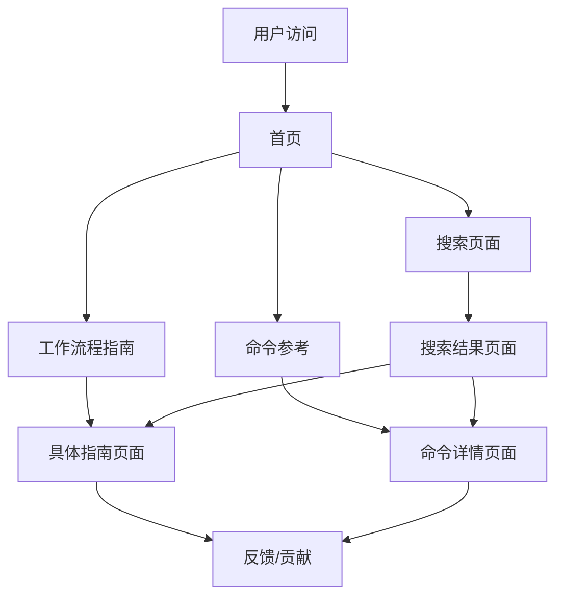

# Claude Code 最佳实践文档中心 - 产品需求文档

## 1. 产品概述

本项目旨在构建一个集中化的Claude Code最佳实践文档中心，通过自动化爬取和整合现有优质资源，为开发者提供全面、实用的Claude Code使用指南。

* 解决Claude Code用户在寻找最佳实践时信息分散、难以获取的问题，为开发者提供一站式的学习和参考平台。

* 通过现代化的文档平台和自动化部署流程，确保内容的及时更新和良好的用户体验。

## 2. 核心功能

### 2.1 用户角色

| 角色    | 访问方式       | 核心权限           |
| ----- | ---------- | -------------- |
| 普通用户  | 直接访问文档站点   | 浏览所有文档内容、搜索、反馈 |
| 内容维护者 | GitHub仓库权限 | 编辑文档、管理内容、审核更新 |
| 系统管理员 | 完整系统权限     | 配置部署、管理爬虫、监控系统 |

### 2.2 功能模块

本文档中心包含以下核心页面：

1. **首页**：项目介绍、快速导航、热门文档推荐
2. **工作流程指南**：基于ctok.ai内容的详细工作流程文档
3. **命令参考**：基于claude-code-cookbook的命令和角色文档
4. **搜索页面**：全站文档搜索和分类筛选
5. **关于页面**：项目说明、贡献指南、联系方式

### 2.3 页面详情

| 页面名称   | 模块名称  | 功能描述                     |
| ------ | ----- | ------------------------ |
| 首页     | 导航区域  | 展示主要文档分类，提供快速访问入口        |
| 首页     | 推荐内容  | 显示热门和最新的最佳实践文档           |
| 首页     | 搜索框   | 全站内容搜索功能                 |
| 工作流程指南 | 代码库理解 | 详细说明如何使用Claude Code理解新项目 |
| 工作流程指南 | 错误修复  | 展示高效的错误诊断和修复流程           |
| 工作流程指南 | 代码重构  | 提供安全的代码重构最佳实践            |
| 工作流程指南 | 测试处理  | 说明测试编写和维护的最佳方法           |
| 工作流程指南 | PR管理  | 展示拉取请求创建和管理流程            |
| 工作流程指南 | 文档处理  | 介绍文档生成和维护的最佳实践           |
| 命令参考   | 命令列表  | 展示所有可用的自定义命令及其用法         |
| 命令参考   | 角色设置  | 说明不同专家角色的使用方法            |
| 命令参考   | 钩子配置  | 介绍自动化脚本的配置和使用            |
| 搜索页面   | 搜索结果  | 显示搜索结果并支持分类筛选            |
| 搜索页面   | 高级筛选  | 提供按类型、标签等条件的高级搜索         |
| 关于页面   | 项目介绍  | 说明项目目标、特色和价值             |
| 关于页面   | 贡献指南  | 提供内容贡献和改进的指导             |

## 3. 核心流程

### 用户访问流程

用户访问文档站点 → 浏览首页推荐内容或使用搜索 → 选择感兴趣的文档分类 → 阅读具体的最佳实践指南 → 可选择反馈或贡献内容

### 内容更新流程

自动爬虫定期抓取源站点内容 → 内容处理和格式化 → 提交到GitHub仓库 → 触发自动部署 → Vercel部署更新 → 用户看到最新内容

### 手动维护流程

内容维护者编辑GitHub仓库中的文档 → 提交更改 → GitHub webhook触发 → Vercel自动部署 → 文档站点更新

## 4. 用户界面设计

### 4.1 设计风格

* **主色调**：深蓝色 (#1e40af) 和浅蓝色 (#3b82f6)，体现专业和技术感

* **辅助色**：灰色系 (#6b7280, #f3f4f6) 用于背景和次要信息

* **按钮样式**：圆角矩形，悬停时有渐变效果

* **字体**：Inter 字体系列，代码使用 JetBrains Mono

* **布局风格**：现代卡片式布局，左侧导航 + 主内容区域

* **图标风格**：使用 Heroicons 或 Lucide 图标库，保持一致性

### 4.2 页面设计概览

| 页面名称   | 模块名称 | UI元素                    |
| ------ | ---- | ----------------------- |
| 首页     | 导航区域 | 顶部导航栏，深蓝色背景，白色文字，Logo居左 |
| 首页     | 英雄区域 | 大标题 + 副标题 + CTA按钮，渐变背景  |
| 首页     | 推荐内容 | 3列卡片布局，每个卡片包含标题、摘要、标签   |
| 工作流程指南 | 侧边栏  | 固定左侧导航，显示所有工作流程分类       |
| 工作流程指南 | 内容区域 | Markdown渲染，代码高亮，步骤编号    |
| 命令参考   | 命令列表 | 表格形式展示，支持搜索和筛选          |
| 命令参考   | 命令详情 | 代码示例 + 参数说明 + 使用场景      |
| 搜索页面   | 搜索框  | 居中大搜索框，支持实时搜索建议         |
| 搜索页面   | 结果列表 | 列表式布局，高亮匹配关键词           |

### 4.3 响应式设计

采用移动优先的响应式设计策略：

* **桌面端**：左侧固定导航 + 主内容区域，最佳阅读体验

* **平板端**：可折叠侧边栏，保持良好的内容展示

* **移动端**：汉堡菜单导航，单列布局，优化触摸交互

* **触摸优化**：按钮和链接区域不小于44px，支持手势操作

