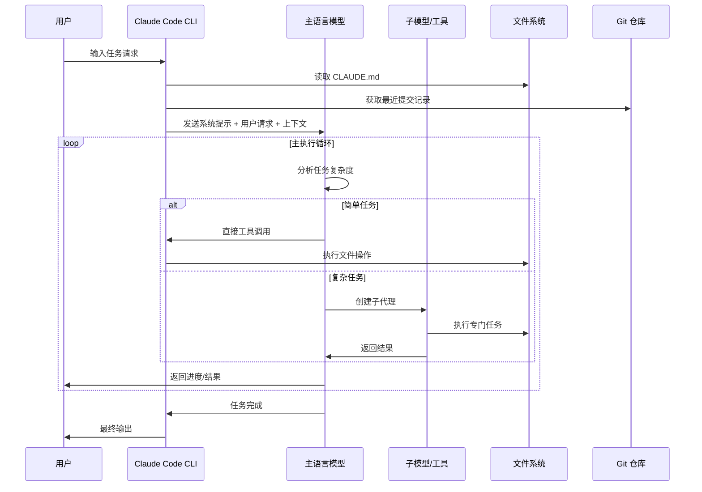
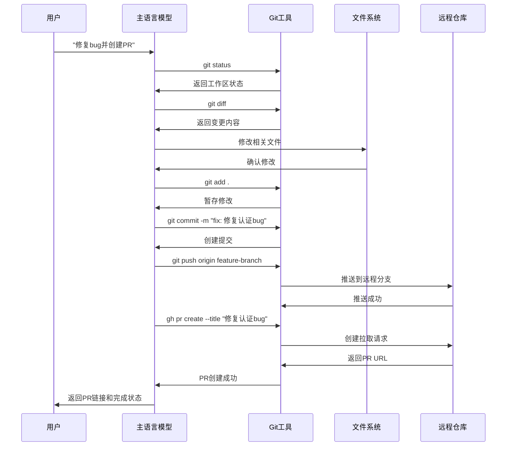
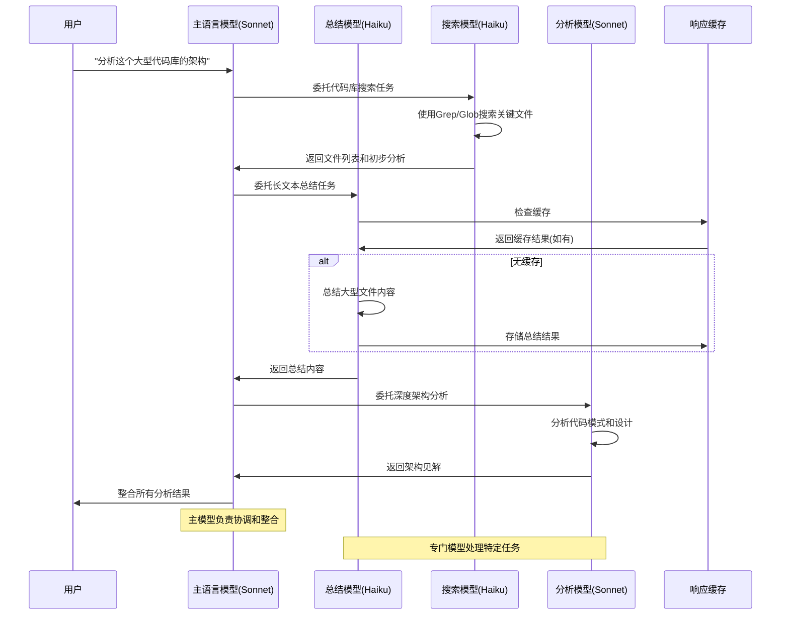
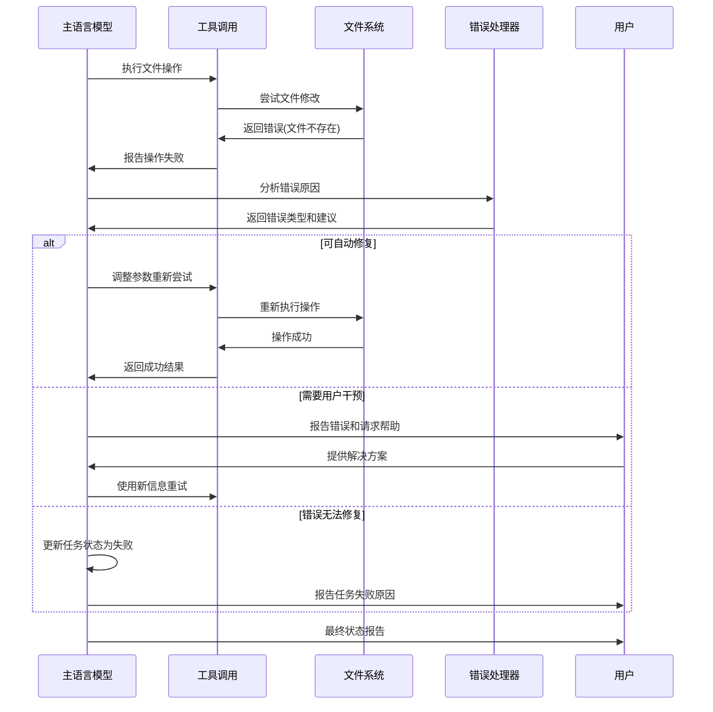

Claude Code 是我迄今为止使用过的最令人愉悦的 AI 智能体（AI agent）/工作流程。它不仅让有针对性的编辑或随意编码一次性工具变得不那么烦人，使用 Claude Code 还让我感到快乐。它有足够的自主性来做有趣的事情，同时不会像其他一些工具那样产生令人不安的失控感。当然，大部分繁重的工作是由新的 Claude 4 模型完成的（特别是交织思维 interleaved thinking）。但我发现，即使使用相同的底层模型，Claude Code 相比 Cursor 或 Github Copilot 智能体客观上使用起来更不令人烦恼！是什么让它如此出色？如果你正在阅读这篇文章并表示赞同，我将尝试提供一些答案。

为了一窥其内部运作，[Sreejith](https://x.com/ppsreejith_) 编写了一个记录器，拦截并记录每个网络请求。以下分析基于我过去几个月的广泛使用。**这篇文章试图回答这个问题——"是什么让 Claude Code 如此出色，你如何在自己的基于聊天的大语言模型智能体中提供类似 CC 的体验？"** 我们已经将其中大部分内容融入到 MinusX 中，我也很兴奋地想看到你也这样做！
## [如何构建类似 Claude Code 的智能体：TL;DR](#如何构建类似-claude-code-的智能体tldr)
如果只能从中获得一个收获的话，那就是这个——**保持简单，愚蠢**（Keep Things Simple, Dummy）。大语言模型本身就足够难以调试和评估了。你引入的任何额外复杂性（多智能体、智能体交接或复杂的RAG检索增强生成算法）只会让调试难度增加10倍。如果这样一个脆弱的系统真的能工作，你会害怕日后对它进行大幅修改。所以，把所有东西放在一个文件里，避免过多的样板脚手架，并且至少要把它们全部重写几次 :)
以下是从 Claude Code 中总结出的，可以应用到你自己系统中的主要收获。
### [1\. 控制循环](#1-控制循环)
*   1.1 [保持一个主循环（最多一个分支）和一个消息历史记录](#11-%E4%BF%9D%E6%8C%81%E5%8D%95%E4%B8%80%E4%B8%BB%E5%BE%AA%E7%8E%AF)
*   1.2 [大量使用更小的模型。所有事情。都要。用。](#12-%E4%B8%BA%E4%B8%80%E5%88%87%E4%BD%BF%E7%94%A8%E6%9B%B4%E5%B0%8F%E7%9A%84%E6%A8%A1%E5%9E%8B)
### [2\. 提示词](#2-提示词)
*   2.1 [使用 claude.md 模式协作和记住用户偏好](#21-%E4%BD%BF%E7%94%A8-claudemd-%E5%8D%8F%E4%BD%9C%E5%A4%84%E7%90%86%E7%94%A8%E6%88%B7%E4%B8%8A%E4%B8%8B%E6%96%87%E5%92%8C%E5%81%8F%E5%A5%BD)
*   2.2 [使用特殊的 XML 标签、Markdown 和大量示例](#22-%E7%89%B9%E6%AE%8A%E7%9A%84-xml-%E6%A0%87%E7%AD%BEmarkdown-%E5%92%8C%E5%A4%A7%E9%87%8F%E7%A4%BA%E4%BE%8B)
### [3\. 工具](#3-工具)
*   3.1 [LLM 搜索 >>> 基于 RAG 的搜索](#31-llm-%E6%90%9C%E7%B4%A2--%E5%9F%BA%E4%BA%8E-rag-%E7%9A%84%E6%90%9C%E7%B4%A2)
*   3.2 [如何设计好的工具？（高级vs低级工具）](#32-%E5%A6%82%E4%BD%95%E8%AE%BE%E8%AE%A1%E5%A5%BD%E7%9A%84%E5%B7%A5%E5%85%B7%E4%BD%8E%E7%BA%A7vs%E9%AB%98%E7%BA%A7%E5%B7%A5%E5%85%B7)
*   3.3 [让你的智能体管理自己的待办事项列表](#33-%E8%AE%A9%E6%99%BA%E8%83%BD%E4%BD%93%E7%AE%A1%E7%90%86%E5%BE%85%E5%8A%9E%E4%BA%8B%E9%A1%B9%E5%88%97%E8%A1%A8)
### [4\. 可控性](#4-可控性)
*   4.1 [语调和风格](#41-%E8%AF%AD%E8%B0%83%E5%92%8C%E9%A3%8E%E6%A0%BC)
*   4.2 ["**请注意这很重要**"不幸仍然是最先进的方法](#42-%E8%AF%B7%E6%B3%A8%E6%84%8F%E8%BF%99%E5%BE%88%E9%87%8D%E8%A6%81%E4%B8%8D%E5%B9%B8%E4%BB%8D%E7%84%B6%E6%98%AF%E6%9C%80%E5%85%88%E8%BF%9B%E7%9A%84%E6%96%B9%E6%B3%95)
*   4.3 [编写算法，包含启发式方法和示例](#43-%E7%BC%96%E5%86%99%E7%AE%97%E6%B3%95%E5%8C%85%E5%90%AB%E5%90%AF%E5%8F%91%E5%BC%8F%E6%96%B9%E6%B3%95%E5%92%8C%E7%A4%BA%E4%BE%8B)
> Claude Code 在每个关键节点都选择了架构简单性——一个主循环、简单搜索、简单待办事项列表等。抵制过度工程化的冲动，为模型构建良好的运行环境，让它自由发挥！这是否又是端到端自动驾驶的重演？苦涩的教训？
* * *
## [1\. 控制循环设计](#1-控制循环设计)

### [Claude Code 整体架构时序图](#claude-code-整体架构时序图)



### [1.1 保持单一主循环](#11-保持单一主循环)
**可调试性 >>> 复杂的手工调优多智能体语言链图节点混合体**
尽管多智能体系统正大行其道，Claude Code 只有一个主线程。它确实会定期使用几种不同类型的提示来总结 git 历史记录、将消息历史记录合并为一条消息或生成一些有趣的用户体验元素。但除此之外，它维护的是一个扁平的消息列表。它处理分层任务的有趣方式是将自身生成为子智能体，但这个子智能体没有能力生成更多子智能体。最多只有一个分支，其结果作为"工具响应"添加到主消息历史记录中。
如果问题足够简单，主循环就通过迭代工具调用来处理它。但如果有一个或多个复杂的任务，主智能体会创建自身的克隆。最大单分支和待办事项列表的组合确保智能体能够将问题分解为子问题，同时也保持对最终期望结果的关注。
我高度怀疑你的应用需要多智能体系统。每增加一层抽象，你就让系统更难调试，更重要的是，你偏离了通用模型改进轨迹。
### [1.2 为_一切_使用更小的模型](#12-为一切使用更小的模型)
## [2\. 提示词](#2-提示词-1)
Claude Code 有极其精细的提示词，充满了启发式方法、示例和重要（咗咕）提醒。系统提示大约有 2800 个 token 长，而工具部分占了高达 9400 个 token。用户提示总是包含 claude.md 文件，通常可以再增加 1000-2000 个 token。系统提示包含关于语调、风格、主动性、任务管理、工具使用政策和执行任务的部分。它还包含日期、当前工作目录、平台和操作系统信息以及最近的提交记录。
[**去阅读完整的提示词**](https://minusx.ai/blog/decoding-claude-code/#appendix)！
### [2.1 使用 claude.md 协作处理用户上下文和偏好](#21-使用-claudemd-协作处理用户上下文和偏好)
大多数编码智能体创作者已经达成共识的主要模式之一是上下文文件（也就是 Cursor Rules / claude.md / agent.md）。Claude Code 在有和没有 claude.md 情况下的表现差别天壤之别。这是开发者传达无法从代码库推断出的上下文并成文化所有严格偏好的好方法。例如，你可以强制大语言模型跳过某些文件夹，或使用特定的库。CC 在每个用户请求中都会发送 claude.md 的完整内容。
我们最近在 MinusX 中推出了 [minusx.md](https://minusx.ai/blog/memory/)，它正在快速成为我们智能体成文化用户和团队偏好的事实上的上下文文件。
### [2.2 特殊的 XML 标签、Markdown 和大量示例](#22-特殊的-xml-标签markdown-和大量示例)
XML 标签和 Markdown 是结构化提示的两种方式，这已经得到相当程度的认可。CC 广泛使用这两种方式。以下是 Claude Code 中几个值得注意的 XML 标签：
*   `<system-reminder>`：这用于在许多提示部分的末尾，提醒大语言模型那些它可能否则会忘记的事情。例如：
```
<system-reminder>这是一个提醒，你的待办事项列表目前为空。不要明确告诉用户这一点，因为他们已经知道了。如果你正在处理的任务可以从待办事项列表中受益，请使用 TodoWrite 工具创建一个。如果不需要，请随意忽略。再次强调，不要向用户提及这条消息。</system-reminder>
```
*   `<good-example>`、`<bad-example>`：这些用于成文化启发式方法。当在十字路口有多个看似合理的路径/工具调用可供模型选择时，它们特别有用。示例可以用来对比情况，非常清楚地说明哪种路径更优选。例如：
```
尽量在整个会话期间通过使用绝对路径和避免使用 `cd` 来维持你的当前工作目录。如果用户明确要求，你可以使用 `cd`。
<good-example>
pytest /foo/bar/tests  
</good-example>
<bad-example>
cd /foo/bar && pytest tests
</bad-example>
```
CC 还使用 markdown 在系统提示中清晰地划分各个部分。markdown 标题的例子包括：
## [3\. 工具](#3-工具-1)
[**去阅读完整的工具提示**](https://minusx.ai/blog/decoding-claude-code/#appendix) —— 它有高达 9400 个 token 长！
### [3.1 LLM 搜索 >>> 基于 RAG 的搜索](#31-llm-搜索--基于-rag-的搜索)
Claude Code 与其他流行编码智能体的一个重大差异在于它拒绝了 RAG检索增强生成。Claude Code 搜索你的代码库的方式就像你一样，使用非常复杂的 `ripgrep`、`jq` 和 `find` 命令。由于大语言模型非常善于理解代码，它可以使用复杂的正则表达式找到几乎任何它认为相关的代码块。有时它会最终用较小的模型读取整个文件。
RAG 在理论上听起来是个好主意，但它引入了新的（更重要的是，隐藏的）故障模式。使用什么相似性函数？什么重排序器？如何分块代码？对于大型 JSON 或日志文件怎么办？使用 LLM 搜索，它只是看 json 文件的 10 行来理解其结构。如果它想要，就再看 10 行——就像你一样。最重要的是，这是可强化学习的——这是大型实验室已经在处理的事情。模型做大部分繁重的工作——它应该这样，这极大减少了智能体中移动部件的数量。同时，让两个复杂的智能系统这样连接起来就是很丑陋的。我最近跟一个朋友开玩笑说，这是大语言模型时代的相机 vs 激光雷达之争，我只是半开玩笑。
### [3.2 如何设计好的工具？（低级vs高级工具）](#32-如何设计好的工具低级vs高级工具)
这个问题让任何正在构庻大语言模型智能体的人彻夜难眠。你应该给模型通用任务（像有意义的动作）还是应该是低级的（像打字和点击和 bash）？答案是这取决于具体情况（而且你应该两者都用）。
Claude Code 有低级（Bash、Read、Write）、中级（Edit、Grep、Glob）和高级工具（Task、WebFetch、exit\_plan\_mode）。CC 可以使用 bash，那为什么要单独给一个 Grep 工具？这里真正的权衡在于你期望你的智能体使用这个工具的频率 vs 智能体使用该工具的准确性。CC 使用 grep 和 glob 非常频繁，所以把它们做成单独的工具是有意义的，但同时，它也可以为特殊场景编写通用的 bash 命令。
同样，还有甚至更高级的工具，如 WebFetch 或 'mcp\_\_ide\_\_getDiagnostics'，它们在功能上非常确定。这可以让大语言模型免于做多个低级的点击和打字，并保持在正轨上。帮帮这个可怜的模型吧！工具描述有精细的提示，带有大量示例。系统提示包含关于“何时使用工具”或如何在可以做相同任务的两个工具之间进行选择的信息。
**Claude Code 中的工具：**
*   [Task](https://minusx.ai/blog/decoding-claude-code/#appendix)
*   [Bash](https://minusx.ai/blog/decoding-claude-code/#appendix)
*   [Glob](https://minusx.ai/blog/decoding-claude-code/#appendix)
*   [Grep](https://minusx.ai/blog/decoding-claude-code/#appendix)
*   [LS](https://minusx.ai/blog/decoding-claude-code/#appendix)
*   [ExitPlanMode](https://minusx.ai/blog/decoding-claude-code/#appendix)
*   [Read](https://minusx.ai/blog/decoding-claude-code/#appendix)
*   [Edit](https://minusx.ai/blog/decoding-claude-code/)
*   [MultiEdit](https://minusx.ai/blog/decoding-claude-code/#appendix)
*   [Write](https://minusx.ai/blog/decoding-claude-code/#appendix)
*   [NotebookEdit](https://minusx.ai/blog/decoding-claude-code/#appendix)
*   [WebFetch](https://minusx.ai/blog/decoding-claude-code/#appendix)
*   [TodoWrite](https://minusx.ai/blog/decoding-claude-code/#appendix)
*   [WebSearch](https://minusx.ai/blog/decoding-claude-code/#appendix)
*   [mcp\_\_ide\_\_getDiagnostics](https://minusx.ai/blog/decoding-claude-code/)
*   [mcp\_\_ide\_\_executeCode](https://minusx.ai/blog/decoding-claude-code/)
### [3.3 让智能体管理待办事项列表](#33-让智能体管理待办事项列表)
这是个好主意的原因很多。上下文腐烂是长期运行的大语言模型智能体的一个常见问题。它们热情洋溢地开始解决一个困难的问题，但随着时间的推移迷失了方向，并退化为垃圾。目前的智能体设计有几种方式来解决这个问题。许多智能体尝试了明确的待办事项（一个模型生成待办事项，另一个模型实现它们）或多智能体交接 + 验证（PRD/PM 智能体 -> 实现者智能体 -> QA 智能体）。
### [Git 集成和版本控制时序图](#git-集成和版本控制时序图)



### [多模型协作时序图](#多模型协作时序图)



### [错误处理和重试机制时序图](#错误处理和重试机制时序图)



## [4\. 可控性](#4-可控性-1)
### [4.1 语调和风格](#41-语调和风格)
CC 明确尝试控制智能体的美学行为。系统提示中有关于语调、风格和主动性的部分——充满了指导和示例。这就是为什么 Claude Code 在其评论和热心程度上“感觉”很有品味。我建议直接将其中大部分内容原样复制到你的应用中。
```
# 一些语调和风格的示例
- 重要：除非用户要求，否则不应该用不必要的开场白或结尾（如解释你的代码或总结你的行动）来回答。
除非用户要求，否则不要添加额外的代码解释总结。
- 如果你不能或不愿意帮助用户做某事，请不要说为什么或可能导致什么，因为这会显得说教和烦人。
- 只有在用户明确要求时才使用表情符号。除非被要求，否则在所有交流中避免使用表情符号。
```
### [4.2 "请注意这很重要"不幸仍然是最先进的方法](#42-请注意这很重要不幸仍然是最先进的方法)
不幸的是，在要求模型不做某事时，CC 也没有更好的方法。IMPORTANT、VERY IMPORTANT、NEVER 和 ALWAYS 似乎是将模型从雷区引开的最佳方式。我期望模型在未来能变得更可控，并避免这种丑陋的做法。但现在，CC 大量使用这种方式，你也应该这样做。一些例子：
```
- 重要：除非被要求，否则不要添加***任何***注释
- 非常重要：你必须避免使用像 `find` 和 `grep` 这样的搜索命令。相反，请使用 Grep、Glob 或 Task 来搜索。你必须避免使用像 `cat`、`head`、`tail` 和 `ls` 这样的读取工具，并使用 Read 和 LS 来读取文件。
  - 如果你*仍然*需要运行 `grep`，停下。总是先使用 `rg` 的 ripgrep
- 重要：你绝不能为用户生成或猜测 URL，除非你确信这些 URL 是为了帮助用户进行编程。你可以使用用户在其消息或本地文件中提供的 URL。
```
### [4.3 编写算法（包含启发式方法和示例）](#43-编写算法包含启发式方法和示例)
识别大语言模型需要执行的最重要任务并为其编写算法是极其重要的。尝试角色扮演为大语言模型并通过示例工作，识别所有决策点并明确地写出它们。如果能以流程图的形式就更好了。这有助于结构化决策制定，并帮助大语言模型遵循指示。一个绝对要避免的事情是一大堆“该做和不该做”的汤。它们更难跟踪，并保持相互排斥。如果你的提示有几千个 token 长，你就不可避免地会有相互冲突的“该做和不该做”。在这种情况下，大语言模型变得极其脆弱，并且无法融入新的用例。
Claude Code 系统提示中的`任务管理`、`执行任务`和`工具使用政策`部分清楚地阐述了要遵循的算法。这也是添加大量启发式方法和大语言模型可能遇到的各种场景示例的部分。
## [额外内容：为什么要关注大型实验室的提示？](#额外内容为什么要关注大型实验室的提示)
在引导大语言模型方面的很多努力都在尝试逆向工程它们的后训练 / 人类反馈强化学习（RLHF）数据分布。你应该使用 JSON 还是 XML？工具描述应该在系统提示中还是只在工具中？你的应用的当前状态怎么办？看看它们在自己的应用中做什么并用它来指导你的应用是有帮助的。Claude Code 的设计非常有主见，这有助于形成你自己的观点。
## [结论](#结论)
主要的收获，再次强调，就是保持简单。极端脚手架框架会对你有害而无益。Claude Code 真的让我相信一个“智能体”可以既简单又极其强大。我们已经将其中许多经验融入到 MinusX 中，并正在继续融入更多。
如果你有兴趣将你自己的大语言模型智能体“Claude Code 化”，我很乐意聊聊——在 [twitter](https://x.com/nuwandavek) 上联系我！如果你想要为你的 Metabase 获得可训练的类似 Claude Code 的数据智能体，请查看 [MinusX](https://minusx.ai/) 或在[这里](https://minusx.ai/demo)与我预约演示。快乐（Claude）编程！
* * *
## [附录](#附录)
_附录内容包含完整的提示词和工具详细信息，可在[MinusX 博客原文](https://minusx.ai/blog/decoding-claude-code/#appendix)中查看。_
*   **提供清晰的决策框架**而非规则列表
## [💡 为什么研究大实验室提示？](#-为什么研究大实验室提示)
理解像 Anthropic 这样的公司如何构建其代理提供了以下洞察：
*   **后训练数据分布**他们期望的
*   **最佳格式**（JSON vs XML）
*   **提示放置策略**（系统 vs 工具）
*   **状态管理方法**
Claude Code 的主观设计反映了关于什么最适合其模型的内部知识。
## [🚀 实施策略](#-实施策略)
### [第一阶段：核心架构](#第一阶段核心架构)
1.  实施具有子代理能力的单主循环
2.  添加上下文文件系统（您的 claude.md 等价物）
3.  创建智能模型选择（在适当的地方使用更便宜的模型）
### [第二阶段：高级功能](#第二阶段高级功能)
1.  构建 LLM 原生搜索系统
2.  实施代理管理的待办事项列表
3.  添加带有 XML 标签的全面提示工程
### [第三阶段：优化](#第三阶段优化)
1.  设计语调和风格响应
2.  添加大量示例和启发式方法
3.  创建清晰的算法决策框架
## [🎯 更大的图景](#-更大的图景)
Claude Code 代表了从过度工程化的代理框架向**简单的、以模型为中心的设计**的**范式转变**。关键洞察是模型本身应该承担重任，工具设计应该放大其优势，而不是补偿根本限制。
这种方法是：
*   **比复杂的多代理系统更可调试**
*   **与模型改进轨迹更一致**
*   **随着模型演进更可维护**
*   **在日常使用中更用户友好**
## [🔮 未来影响](#-未来影响)
随着 LLM 变得更有能力，Claude Code 背后的原则变得更加相关：
*   **简洁性比复杂性扩展性更好**
*   **以模型为中心的设计**受益于通用改进
*   **清晰的接口**无论底层能力如何都保持价值
*   **用户体验工程**成为关键差异化因素
接受这些原则的团队和产品将构建更令人愉悦、可维护和有效的 AI 编程工具。
* * *
**想要构建更好的 LLM 代理？** 研究 Claude Code 的方法：选择简洁而非复杂，利用模型的优势，通过周到的提示和工具设计创造令人愉悦的用户体验。
魔力不在于复杂性——而在于让模型发光的**精心简洁性**。
- [复合式工程：构建自我改进的开发系统](/docs/advanced/advanced_compounding-engineering) - 学习如何构建随着每次迭代变得更快、更安全、更优秀的开发系统。将你的工程工作流程从短期收益转变为永久改进。
- [最佳实践](/docs/guides/best-practices) - 学习有效使用 ClaudeCode 的最佳实践
