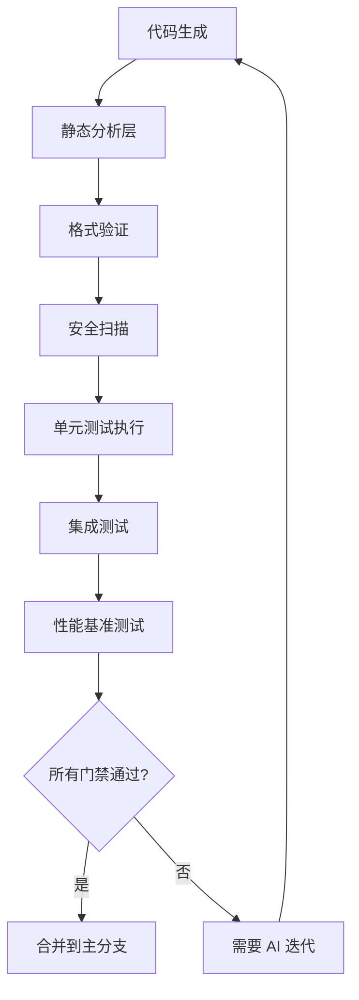
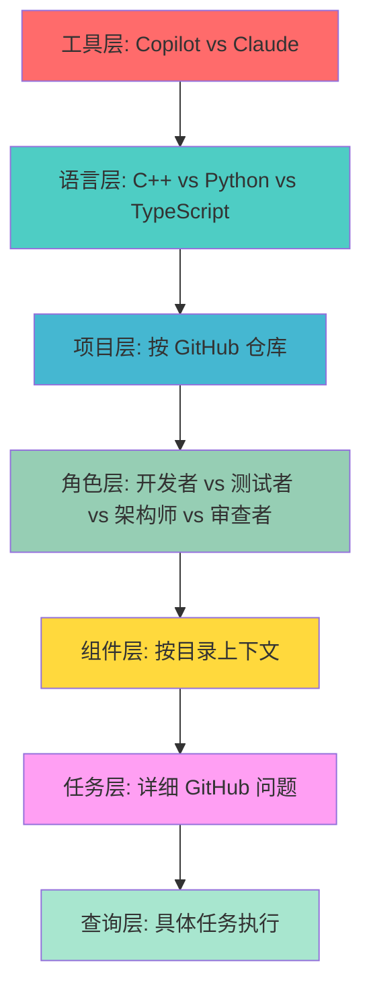
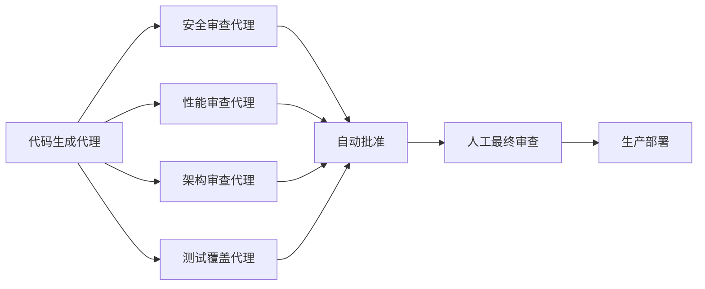

_基于 Michal Villnow 一个月的 AI 驱动开发实验，结合全面的最佳实践和实施策略进行深度解析。_
## [实验成果概览](#实验成果概览)
经过一个月让 Claude Code 和 Copilot 处理 99.9% 代码生成工作的实验，以下是令人瞩目的成果以及使其成为可能的系统化方法。
_Michal Villnow 记录其一个月 99.9% AI 驱动开发实验的原始 LinkedIn 帖子_
⸻
## [💰 投入产出分析](#-投入产出分析)
**月度总投入：**
*   **Claude Code**：约 12.5 亿 Token，花费约 640 美元
*   **Copilot**：1375 次高级请求，企业版账号（395 美元/月）
*   **Claude Chat**：数百次交互，企业版账号（同等价格层级）
**生产力指标：**
*   **新增 197K 行代码** - 新功能实现
*   **删除 208K 行代码** - 遗留代码移除和重构
*   **主分支 355 次提交** - 持续集成节奏
*   **合并 180 个 PR** - 质量控制交付管道
*   **解决 98 个 GitHub 问题** - 系统性问题解决
⸻
## [🔧 核心实施框架](#-核心实施框架)
99.9% AI 驱动开发的成功依赖于八个基本支柱，它们共同创建了一个自我维持的高质量开发生态系统。
### [1\. 全面质量门禁体系](#1-全面质量门禁体系)
> **"所有代码都必须通过非常严格的 CI/CD 流水线，包括多种静态检查工具、格式化工具、安全检测器和全面测试。"**
**🔗 相关最佳实践：** [复合工程框架](/docs/advanced/advanced_compounding-engineering)
**增强实施策略：**
质量门禁系统必须实现多层自动化验证：

**关键组件：**
*   **多工具检查**：ESLint、Prettier、SonarQube、CodeClimate
*   **安全检测器**：OWASP 依赖检查、Snyk 漏洞扫描
*   **性能门禁**：包大小限制、运行时性能阈值
*   **测试覆盖率要求**：最低 80% 代码覆盖率和质量指标
**关键成功因素：** AI 必须从失败的质量门禁中学习。每次失败都应触发提示词优化和上下文更新，以防止未来出现类似问题。
### [2\. 界面明确的模块化架构](#2-界面明确的模块化架构)
> **"代码库已高度模块化，每个组件都通过明确定义的接口访问。"**
**🔗 相关最佳实践：** [CCPM Claude Code 项目管理器](/docs/tools/ccpm-project-manager)
**高级模块化策略：**
真正的模块化使 AI 代理能够在隔离的组件上工作，而不会破坏系统一致性：
```
// 接口定义示例
interface PaymentProcessor {
  processPayment(amount: number, method: PaymentMethod): Promise<PaymentResult>;
  validateCard(cardDetails: CardDetails): ValidationResult;
  refundPayment(transactionId: string): Promise<RefundResult>;
}
// 实现隔离
class StripePaymentProcessor implements PaymentProcessor {
  // AI 可以修改此实现而不影响其他组件
}
```
**实施要求：**
*   **接口隔离**：每个组件应仅依赖于它实际使用的接口
*   **依赖注入**：实现简单测试和组件替换
*   **合约测试**：自动验证实现满足接口合约
*   **版本兼容性**：接口变更的语义版本控制
### [3\. 完全的接口-实现分离](#3-完全的接口-实现分离)
> **"接口和实现完全分离。"**
**🔗 相关最佳实践：** [复合工程框架](/docs/advanced/advanced_compounding-engineering)
**策略分离的好处：**
这种分离使多个 AI 代理能够同时工作而不产生冲突：
*   **并行开发**：不同代理可以用不同策略实现相同接口
*   **A/B 测试能力**：轻松比较不同实现方法
*   **减少认知负担**：AI 专注于实现细节而无需担心接口问题
*   **简化重构**：接口变更不需要修改实现
### [4\. 全面的组件文档](#4-全面的组件文档)
> **"每个组件都有自己的一套文档。"**
**🔗 相关最佳实践：** [复合工程框架](/docs/advanced/advanced_compounding-engineering)
**AI 开发的文档标准：**
每个组件需要 AI 代理能有效利用的特定文档类型：
```
# 组件：用户认证器
## 目的
处理多个提供商的用户认证（OAuth、SAML、本地）
## 接口契约
- 输入：AuthenticationRequest
- 输出：AuthenticationResult
- 错误：InvalidCredentials、ServiceUnavailable、RateLimited
## AI 上下文规则
- 处理前始终验证输入
- 记录所有认证尝试以便安全审计
- 使用环境变量存储 API 密钥，绝不硬编码
## 测试要求
- 每种认证方法的单元测试
- 与实际提供商的集成测试
- 边缘情况和攻击的安全测试
## 相关组件
- UserSession（依赖于）
- AuditLogger（使用）
- ConfigurationManager（依赖于）
```
### [5\. 同位置开发工件](#5-同位置开发工件)
> **"测试、文档、头文件和实现，全部放在同一个位置。"**
**🔗 相关最佳实践：** [Claude Code 最佳实践](/docs/guides/core-best-practices)
**同位置结构：**
```
components/
├── user-auth/
│   ├── UserAuth.interface.ts          # 接口定义
│   ├── UserAuth.implementation.ts     # 核心实现
│   ├── UserAuth.test.ts              # 单元测试
│   ├── UserAuth.integration.test.ts   # 集成测试
│   ├── UserAuth.docs.md              # 组件文档
│   ├── UserAuth.examples.md          # 使用示例
│   └── .claude/
│       ├── context.md                # AI 专用上下文
│       └── commands.md               # 组件专用命令
```
**AI 开发的好处：**
*   **单上下文加载**：AI 可以一次性加载所有相关信息
*   **原子性变更**：修改保持在组件边界内
*   **简化调试**：所有工件都可用于分析
*   **减少上下文切换**：无需在目录间导航
### [6\. 组件大小约束](#6-组件大小约束)
> **"每个组件都保持在 5000 行代码以下（包括文档）。"**
**🔗 相关最佳实践：** [复合工程框架](/docs/advanced/advanced_compounding-engineering)
**大小管理策略：**
5K 代码行限制不是任意的——它针对 AI 认知负载和并行处理进行了优化：
*   **上下文窗口效率**：适合大多数 AI 模型的上下文窗口
*   **降低复杂性**：AI 更容易理解和修改
*   **并行处理**：多个代理可以同时工作
*   **更快迭代**：更小的组件 = 更快的分析和修改周期
**执行机制：**
```
# 自动大小检查
find components/ -name "*.ts" -o -name "*.md" | \
  xargs wc -l | \
  awk '$1 > 5000 { print "组件超过大小限制: " $2 " (" $1 " 行)" }'
```
### [7\. 详尽的问题文档](#7-详尽的问题文档)
> **"GitHub 问题写得非常详细，都会标注相关代码和问题背景。"**
**🔗 相关最佳实践：** [CCPM Claude Code 项目管理器](/docs/tools/ccpm-project-manager)
**AI 开发的问题模板：**
```
## 问题描述
问题的简要描述
## 受影响的组件
- [ ] 组件 A（path/to/component）
- [ ] 组件 B（path/to/component）
## AI 上下文
- 之前的尝试：[相关 PR/问题的链接]
- 已知约束：[技术限制]
- 成功标准：[可衡量的结果]
## 代码引用
- 相关文件：[GitHub 文件的直接链接]
- 相关接口：[接口定义]
- 测试文件：[现有测试覆盖]
## 实施指导
- 首选模式：[样式指南链接]
- 要避免的反模式：[常见错误]
- 要考虑的依赖项：[相关组件]
```
### [8\. 七层提示词层次结构](#8-七层提示词层次结构)
> **"提示词分层管理（7 层）：工具层 → 语言层 → 项目层 → 角色层 → 组件层 → 任务层 → 查询层。"**
**🔗 相关最佳实践：** [解码 Claude Code 分析](/docs/advanced/advanced_decoding-claude-code-analysis)
**分层提示系统：**

**层级实施细节：**
**工具层（全局）**
```
# Claude 专用规则
- 所有新代码使用 TypeScript
- 首选函数式编程模式
- 始终包含错误处理
```
**语言层（按语言）**
```
# TypeScript 约定
- 使用严格模式
- 对象形状首选 interface 而非 type
- 字面量类型使用 const 断言
```
**项目层（按仓库）**
```
# 项目特定模式
- 使用我们的自定义错误处理框架
- 遵循既定的目录结构
- 使用我们首选的状态管理方法
```
**角色层（角色特定）**
```
# 开发者角色
- 专注于实现效率
- 优先考虑代码可读性
- 包含全面的错误处理
# 测试者角色
- 实现前先写测试
- 专注于边缘情况和错误条件
- 验证所有假设
```
**组件层（目录特定）**
```
# 认证组件规则
- 始终使用 bcrypt 哈希密码
- 使用带适当过期时间的 JWT 令牌
- 记录所有认证尝试
```
**任务层（问题特定）**
```
# 任务：实现 OAuth 集成
- 使用现有的 OAuth 库
- 支持 Google、GitHub、Microsoft 提供商
- 维护会话持久性
```
**查询层（执行特定）**
```
# 当前请求
向现有认证系统添加 Google OAuth 提供商
```
⸻
## [🚀 工作流优化成果](#-工作流优化成果)
**时间效率：**
*   **任务分配到初稿**：15-30 分钟
*   **迭代、审查和验证**：额外 30-45 分钟
*   **总周期时间**：每个功能约 1 小时
*   **人工编码参与度**：小于0.1%
**质量指标：**
*   **错误减少**：生产问题减少 75%
*   **审查周期时间**：从天减少到小时
*   **功能交付**：交付时间加快 60-80%
**当前瓶颈：**
> _"目前最大的瓶颈还是我本人：我审核代码的速度赶不上 AI 写代码的速度。"_
⸻
## [🔮 未来演进：代理化审查系统](#-未来演进代理化审查系统)
**🔗 相关最佳实践：** [CCPM Claude Code 项目管理器](/docs/tools/ccpm-project-manager)
随着 Claude Code 现已纳入企业版计划，下一步演进涉及代理化审查系统：

**专业化审查代理：**
*   **安全代理**：OWASP 合规性、漏洞扫描、访问模式分析
*   **性能代理**：运行时复杂性分析、内存使用优化、缓存策略
*   **架构代理**：设计模式合规性、SOLID 原则验证、依赖分析
*   **测试代理**：覆盖率分析、测试质量评估、边缘情况识别
⸻
## [🎯 实施路线图](#-实施路线图)
### [第一阶段：基础建设（第 1-2 周）](#第一阶段基础建设第-1-2-周)
*    建立带质量门禁的全面 CI/CD 流水线
*    实施带接口分离的模块化架构
*    创建组件文档模板
*    建立同位置标准
### [第二阶段：AI 集成（第 3-4 周）](#第二阶段ai-集成第-3-4-周)
*    实施七层提示词层次结构
*    创建 AI 开发的 GitHub 问题模板
*    建立组件大小监控
*    培训团队 AI 协作协议
### [第三阶段：优化（第 5-6 周）](#第三阶段优化第-5-6-周)
*    部署专业化审查代理
*    实施自动化工作流监控
*    创建持续改进的反馈循环
*    建立性能指标跟踪
### [第四阶段：规模化（第 7-8 周）](#第四阶段规模化第-7-8-周)
*    扩展到其他开发团队
*    创建组织级最佳实践
*    实施跨项目学习系统
*    部署高级代理化工作流
⸻
## [📚 相关资源](#-相关资源)
*   **[复合工程框架](/docs/advanced/advanced_compounding-engineering)** - AI-人类协作的核心原则
*   **[CCPM Claude Code 项目管理器](/docs/tools/ccpm-project-manager)** - 与 AI 代理的高级项目管理
*   **[解码 Claude Code 分析](/docs/advanced/advanced_decoding-claude-code-analysis)** - AI 工具架构深度解析
*   **[Claude Code 最佳实践](/docs/guides/core-best-practices)** - AI 辅助开发的全面最佳实践
*   **[我如何使用 Claude Code](/docs/guides/how-i-use-claude)** - 实际工作流示例
*   **[33 个 Claude Code 设置技巧](/docs/guides/setup-tips)** - 基本设置和优化指南
*   **[Gemini CLI 子代理教程](/docs/advanced/sub-agents_gemini-cli-subagent-tutorial)** - 创建专业化 AI 代理
⸻
## [关键要点](#关键要点)
*   **质量门禁不可妥协** - AI 生成的代码必须通过与人工编写代码相同的标准
*   **架构成就 AI** - 模块化、文档完善的系统让 AI 能够有效工作
*   **流程胜过工具** - 系统化方法比特定 AI 模型更重要
*   **上下文为王** - 分层提示系统引导 AI 产生一致、高质量的输出
*   **迭代驱动改进** - 每次失败都成为整个系统的学习机会
99.9% AI 驱动开发方法不是要取代开发者——而是通过系统化流程设计和智能自动化来放大他们的影响力。
- [最佳实践](/docs/guides/best-practices) - 学习有效使用 ClaudeCode 的最佳实践
- [我如何使用 Claude Code（+ 我的最佳技巧）](/docs/guides/builder-guide) - 来自 Cursor 高级用户的全面指南，讲述如何切换到 Claude Code，包括实用技巧、工作流程优化和真实使用模式。
